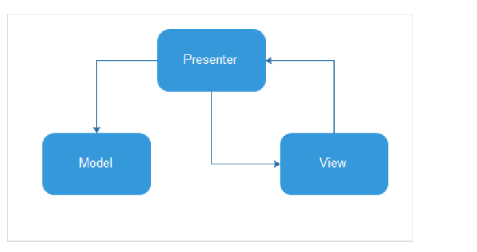
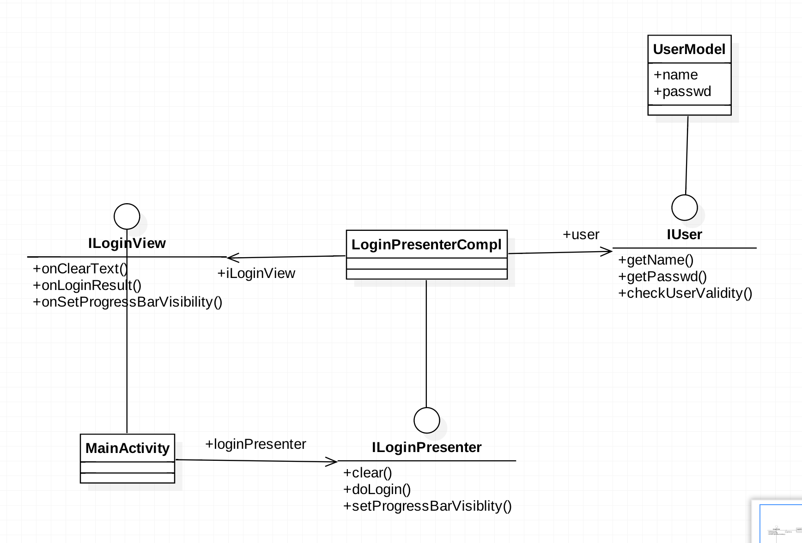

# login
login mvp demo

> 参考文章：[MVP 模式简单易懂的介绍方式](http://kaedea.com/2015/10/11/android-mvp-pattern/)

**MVP模式的核心思想：**

MVP把Activity中的UI逻辑抽象成View接口，把业务逻辑抽象成Presenter接口，Model类还是原来的Model。

该项目：

# first commit
# add 把变更录入到索引中
commit 记录索引的状态